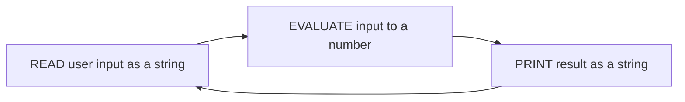
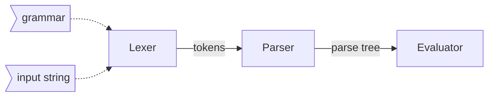
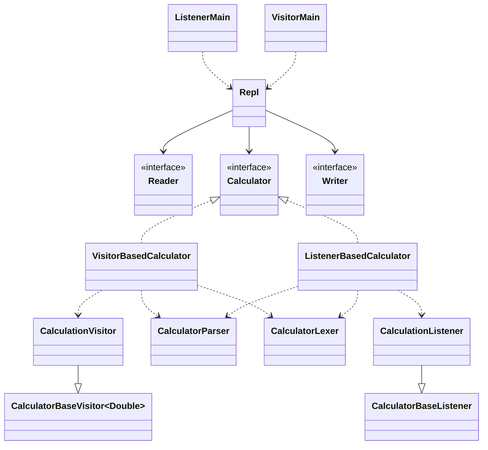
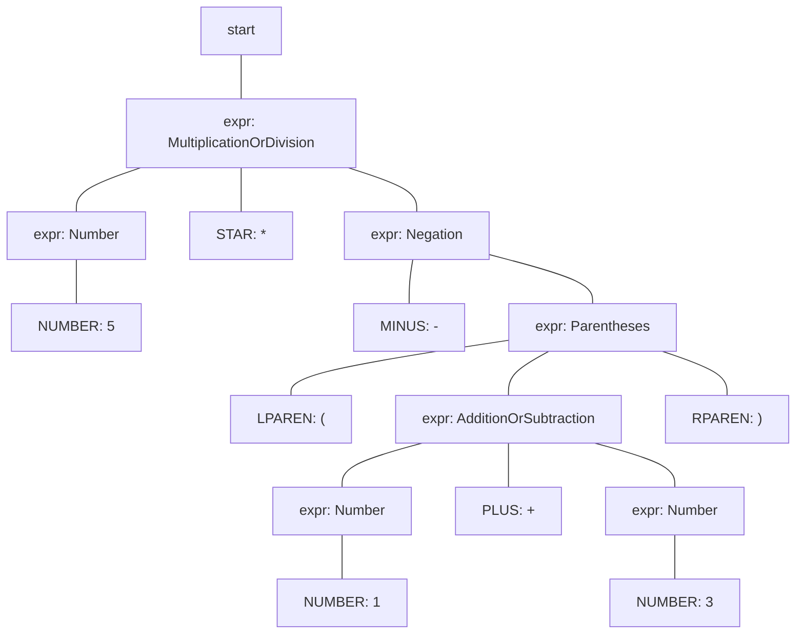

# Architecture

Imagine we have give following input: `-(1 + 3) * 5`.
The calculator outputs: `-20`. But how does it know this?

We interact with our calculator through a REPL,
a read, evaluate, print loop:

Reading input and writing output are done by Java.
It gets interesting in the *evaluate* step:
we need to understand and process the input string.
This is done by combining a parser, a lexer and an evaluator:

Based on our [grammar](src/main/antlr4/nl/arothuis/antlr4calculator/core/parser/Calculator.g4),
a *lexer* and *parser* are generated by ANTLR.
The lexer breaks down the given input into tokens, 
which are the smallest units of meaning in a programming language. 
A parser is a program that takes these tokens and builds a parse tree, 
which represents the structure of the program according to the grammar of the programming language.

The code that isn't generated by ANTLR consists of two examples:
a visitor-based one and a listener-based one. For each, we've
made an *evaluator*, which evaluates the nodes of a parse tree
into a number, and a *calculator*, which is the name for our
interpreter: it consists of the entire process of lexing, parsing 
and evaluating. Our *REPL* is used
to connect user input (`Reader`) with 
one of our `Calculator` classes and an output (`Writer`).
We have two Main-classes to demonstrate the composition of either approach.

All together, the structure could be summarized in the following diagram:

## What does a parse tree look like?

The input `-(1 + 3) * 5` is translated into 
the following parse tree, based on our grammar:

In order to calculate the result, we need to traverse the tree.
The traversal starts at the root node of the parse tree and visits each node. 
At each node, we apply the appropriate operation based on the node's type 
(either an expression or a terminal). The result of the evaluation is 
collected as the traversal progresses, 
and is returned when the traversal is complete.

There are two approaches to traversing the parse tree: 
the *listener approach* and the *visitor approach*.

## Listener versus Visitor
In the *listener approach*
we use ANTLR's TreeWalker to walk over the nodes in the parse tree,
which we give our calculator in its walk-method. 
Our ListenerBasedCalculator *listens* to events during this traversal.
We use a stack to keep track of the number we've seen last.

The *visitor approach* does not use a TreeWalker to traverse
the parse tree. Our calculator navigates through the tree itself,
by visiting the parse tree.

### How does the Visitor work?
The Visitor visits each node in the given parse tree.
This principle is based on the
[visitor pattern](https://refactoring.guru/design-patterns/visitor).

If the node is an expression, it tries to evaluate the expression
until terminals (in this grammar: *numbers*) are found.
For non-terminals (in this grammar: *operations*),
How the operations should be applied
is defined in the visitor's methods. If a node is visited that is
a number, it is converted to Double and returned.

In our grammar, numbers are our only terminals. They are
the only tokens that need to be converted into a Java datatype
(Double, for convenience's sake). Operations, if any, are then applied
to the returned values.

The order of operations is specified in the grammar.
This is a feature of ANTLR4 through the order
of possible matches for a certain production rule.
Labels have been added to the grammar to make it easier
to identify a rule and certain tokens by name, considerably
simplifying the work the Visitor has to do.

### How does the Listener work?
The Listener listens to `enter` and `exit` events
for each rule and token matched.
These events are emitted when traversing the parse tree.
This mechanism is comparable to the
[Observer pattern](https://refactoring.guru/design-patterns/observer)

An `enter` event occurs before traversing a node's children,
an `exit` event occurs after traversing a node's children.
Before dealing with the result of a non-terminal, its children
should be traversed first.

In this example, a [stack-based](https://en.wikipedia.org/wiki/Stack_(abstract_data_type))
listener is implemented.
The stack records the last number seen according to Last In First Out.
For each number traversed a Double is pushed
to the stack.
For each operation performed, the right number is popped off,
the left number is popped off and the result of the operation
is pushed back on the stack. 
